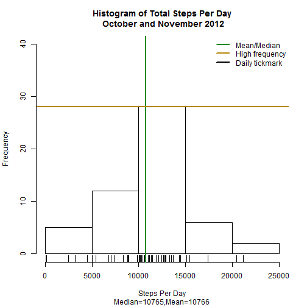
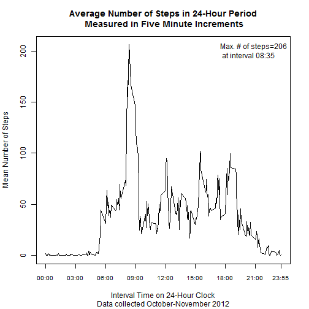
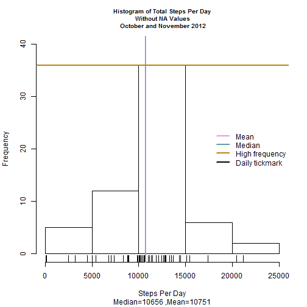
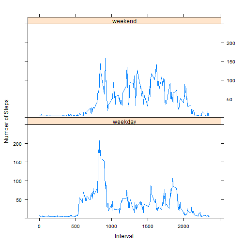

Reproducible Research Project One
==================================
### January 17, 2015

# Abstract

After evaluating the data with NA values and NA values replaced, several common patterns 
emerged. Examination of the NA values suggested that the user did not wear the measuring device 
several days. Replacing NA values with the mean of the mean of steps on a daily basis changed the data. 
The data also showed a difference in levels of activity between weekdays and weekends, suggesting the 
wearer worked normal U.S. office work hours during the work week and had a sendentary job.

# Introduction

The data for the project was collected from a personal activity monitoring device that collected data 
at 5 minute intervals throughout the day. There were five project goals:  
1.   Load and preprocess the data  
2.	Calculate the mean total number of steps per day  
3.	Record the average daily activity pattern  
4.	Imput missing data  
5.	Identify differences between weekday and weekend activity levels  

## Description of Data Set

The data consisted of two months of data collected during October and November 2012 from one 
anonymous person. The data included three variables: the date, the five-minute interval starting with 
00:05 after midnight and concluding with the time 23:55 in integer values, and the number of steps 
taken for each date and interval combination. Each row had one unique combination of date and 
interval values.

## Assumptions:
1.	The user stores and runs this program in his working directory.
2.	The user has sufficient connection speed to download files off the internet.
3.	The user has sufficient memory to process the script.
4.	The user has the following packages with libraries installed:


```r
library(base)  
library(utils)  
library(graphics)  
library(grDevices)  
library(stringr)  
library(plyr)  
library(lattice)  
```

## Documentation Conventions:

Each assignment section has subsections in bold for **Computations** and **Conclusion**.  

R functions appear in the text blocks the first time as *function-name* in italics followed 
by "function." Subsequent references use the format *function-name()*.

Calculated variable names appear within the text blocks as `variable-name`.  

Field or variable names within an R data frame appear within the text blocks as **field-name** in bold
followed by "field."

# Assignment Steps

## 1.	Loading and preprocessing the data.

#### Computations:

The R code downloaded the winzip file from the internet and wrote over any existing file on the user's 
working directory. It then unziped the data file to the working directory. The unzipped file contained 
the date and time stamp from the original archive as verification of authenticity. The final step was 
to load the data into R as a data frame. 


```r
myfile <- "repdata_data_activity.zip"  
mypath <- "http://d396qusza40orc.cloudfront.net/repdata%2Fdata%2Factivity.zip"  
download.file(mypath, myfile, quiet = FALSE, mode = "wb")  
unzip(myfile, overwrite = TRUE, exdir = ".", unzip = "internal", setTimes = TRUE)  
myfileactivity <- "activity.csv"  
mydata <- read.csv(myfileactivity, colClasses = c("integer", "POSIXct", "integer"))  
```


#### Conclusion:

The only transformation necessary occurred upon importing the data using specific data types. The 
data was already normalized.


```r
str(mydata)
```

```
## 'data.frame':	17568 obs. of  3 variables:
##  $ steps   : int  NA NA NA NA NA NA NA NA NA NA ...
##  $ date    : POSIXct, format: "2012-10-01" "2012-10-01" ...
##  $ interval: int  0 5 10 15 20 25 30 35 40 45 ...
```


## 2.	Steps Taken Per Day

What is the mean total number of steps taken per day?

#### Computations:

To calculate the total number of steps per day, I used the *aggregate* function to apply the *sum* 
function to the **steps** field based upon the **date** field. Since *aggregate()* removed NA values, 
this met the first criteria of ignoring missing values.


```r
## calculate sum of steps by date
mystepssum <- aggregate(steps ~ date, data = mydata, sum)  
str(mystepssum)  
```

```
## 'data.frame':	53 obs. of  2 variables:
##  $ date : POSIXct, format: "2012-10-02" "2012-10-03" ...
##  $ steps: int  126 11352 12116 13294 15420 11015 12811 9900 10304 17382 ...
```

### 2.A.	Histogram

Make a histogram of the total number of steps taken each day.

### 2.B.	Calculate Mean and Median

Calculate and report the mean and median total number of steps taken per day.

#### Computations:

I calculated the mean and median plus the highest frequency and included all these figures in 
the histogram.


```r
## calculate mean and median
mymean <- as.integer(mean(mystepssum$steps))  
mymedian <- as.integer(median(mystepssum$steps))  
mycalc <- (mymean + mymedian)/2  
mysubtitle <- paste("Median=",mymedian,",","Mean=",mymean, sep="")  

## report mean and median
mymean; mymedian  
```

```
## [1] 10766
```

```
## [1] 10765
```

Calculating the highest frequency to include on the plot required creating the histogram object but 
not creating the plot. I then reordered the results and retreived the first, or largest, count.


```r
myplotstepssum <- hist(mystepssum$steps, plot = FALSE)  
myorder <- order(myplotstepssum$counts, decreasing=TRUE)  
myhighcount <- myplotstepssum$counts[myorder[1]]  

## report highest frequency
myhighcount  
```

```
## [1] 28
```

The histogram indicated the mean and median values and marked the highest frequency count. This was 
important for later problems in the assignment.


```r
hist(mystepssum$steps, main = "Histogram of Total Steps Per Day\n October and November 2012", ylim = c(0,40), xlab = "Steps Per Day", plot = TRUE)  

rug(mystepssum$steps)  
abline(v = mycalc, col = "forestgreen", lwd = 2)  
abline(h = myhighcount, col = "darkgoldenrod", lwd = 2)  
legend("topright", bty="n", lty = 1, lwd = 2, col = c("forestgreen", "darkgoldenrod", "black"), legend = c("Mean/Median", "High frequency", "Daily tickmark"))  
title(sub=mysubtitle)  
```

 

#### Conclusion:

The *aggregate()* removed NA values before applying *sum()*. This histogram showed that the total
number of
steps taken per day varied. The mean `mymean` and median `mymedian` for the total number of steps taken 
per day were almost identical. The highest frequency count `myhighcount` was below 30.


```r
## report mean, median and highest frequency count
mymean; mymedian; myhighcount  
```

```
## [1] 10766
```

```
## [1] 10765
```

```
## [1] 28
```

## 3.	What is the average daily activity pattern?

#### Computations:

To answer this question, I first calculated the mean number of steps for each interval. 


```r
mystepsim <- aggregate(steps ~ interval, data = mydata, mean)  
str(mystepsim)  
```

```
## 'data.frame':	288 obs. of  2 variables:
##  $ interval: int  0 5 10 15 20 25 30 35 40 45 ...
##  $ steps   : num  1.717 0.3396 0.1321 0.1509 0.0755 ...
```

## 3.A.	Time series plot

Make a time series plot (i.e. type = "1") of the 5-minute interval (x-axis) and the average 
number of steps taken, averaged across all days (y-axis).

## 3.B.	Interval with maximum number of steps

Which 5-minute interval, on average across all the days in the dataset, contains the maximum 
number of steps?  

#### Computations:

Further calculations on the means of the intervals revealed the interval with the highest count. For 
reporting purposes, I formatted the intervals as times using the format hh:mm.


```r
mystepsmax <- mystepsim[with(mystepsim, order(steps, interval, na.last = TRUE, decreasing=TRUE)), ]  
mymaxinterval <- mystepsmax[1,1]  
mymaxstep <- as.integer(mystepsmax[1,2])  

## Report interval at which highest number of steps occurred
mymaxinterval; mymaxstep  
```

```
## [1] 835
```

```
## [1] 206
```

For publication purposes, I formatted the maximum interval `mymaxinterval` using hh:mm.


```r
mymaxinterval <- as.character(mymaxinterval)  
mymaxinterval <- paste("000",mymaxinterval,sep="")  
mymaxinterval <- str_sub(mymaxinterval, start= -4)  
mymaxinterval <- paste(substr(mymaxinterval, 0,2),":",substr(mymaxinterval,3,4),sep="")  
```

I included the maximum interval and steps values in the time series plot as a legend `mytextq3`. 
I created graph labels `myxaxislabelsq3` and custom tickmarks `myxaxisticksq3` for the x axis 
in the format of hh:mm for better readability.


```r
## create graph labels
mymainq3 <- "Average Number of Steps in 24-Hour Period\n Measured in Five Minute Increments"  
myxaxisq3 <- "Interval Time on 24-Hour Clock"  
myyaxisq3 <- "Mean Number of Steps"  
mysubq3 <- "Data collected October-November 2012"  
mytextq3 <- paste("Max. # of steps=",mymaxstep,"\n at interval ",mymaxinterval,sep="")  
myxaxislabelsq3 <- c("00:00", "03:00", "06:00", "09:00", "12:00", "15:00", "18:00", "21:00", "23:55")  
myxaxisticksq3 <- c(0, 300, 600, 900, 1200, 1500, 1800, 2100, 2355)  

## generate the plot
with(mystepsim, plot(interval,steps,type="l",main=mymainq3, sub=mysubq3, xaxt="n", xlab=myxaxisq3, ylab=myyaxisq3))  
legend("topright", bty="n", legend = mytextq3)  
axis(1, at=myxaxisticksq3, labels=myxaxislabelsq3, cex.axis=0.8)  
```

 

#### Conclusion:

The *aggregate()* removed NA values before performing the calculation. The maximum number of 
steps `mymaxstep` occured at an interval `mymaxinterval` in the early morning. The graph also showed 
peaks in activity around noon, 4:00 p.m. and before and after 6:00 p.m. Finally, the graph showed 
a clear pattern of inactivity during the hours of midnight to 5:00 a.m.


```r
## report interval at which the highest step count occurred
mymaxinterval; mymaxstep  
```

```
## [1] "08:35"
```

```
## [1] 206
```


## 4.	Imputing missing values

### 4.A. Calculate missing values.

#### Computations:

The first goal was to calculate and report the total number of missing values in the dataset (i.e. the 
total number of rows with NAs).


```r
## total number of rows in original data set
mytotalrows <- nrow(mydata[, ])  

## number of rows with NA values in original data set
mynarows <- nrow(mydata[is.na(mydata$steps), ])  

## percent of original data set rows with NA values
mynapercent <- round(100 * (mynarows / mytotalrows))  

## report total number of rows, number of rows with NA values and the percent
mytotalrows; mynarows; mynapercent  
```

```
## [1] 17568
```

```
## [1] 2304
```

```
## [1] 13
```

#### Conclusion:

Of all the rows in the original data set `mytotalrows`, more than 13 percent of the rows 
contained NA values `mynarows` , `{r mynarows}` rows, in the **steps** field.  

### 4.B.	Devise a strategy

The strategy must fill in all of the missing values in the dataset. The strategy does not need 
to be sophisticated. For example, it could use the mean/median for that day, or the mean for that 5
-minute interval, etc.

#### Computations:

To determine a strategy, I looked at what dates had NA values, the range of values for the 
**interval** field and how the dates in the original data set with no NA values compared to 
the dates in the original data set with NA values.


```r
myintervals <- length(unique(mydata[, 3]))  
mynaintervals <- length(unique(mydata[is.na(mydata$steps), 3]))  
mynarowsdates <- unique(mydata[is.na(mydata$steps), 2])  
mynarowsdateslength <- length(mynarowsdates)  
```

#### Conclusion:	


The original data and the data made up of NA values both contained the same number of intervals, 
`myintervals` and `mynaintervals`.


```r
myintervals; mynaintervals
```

```
## [1] 288
```

```
## [1] 288
```

The original data set showed a few dates `mynarowsdateslength` whose **steps** fields had NA values, 
`mynarowsdates`.  


```r
mynarowsdateslength; mynarowsdates
```

```
## [1] 8
```

```
## [1] "2012-10-01 PDT" "2012-10-08 PDT" "2012-11-01 PDT" "2012-11-04 PDT"
## [5] "2012-11-09 PST" "2012-11-10 PST" "2012-11-14 PST" "2012-11-30 PST"
```

When comparing the dates of the NA rows with the dates of the non-NA rows, the data sets were mutually 
exclusive. In the following code snipet, `mydatesintersect` demonstrated that none of the dates 
in the **is.na** function subset appeared in the **!is.na()** subset.


```r
mydatesintersect <- intersect(mydata[!is.na(mydata$steps), 2], mydata[is.na(mydata$steps), 2])  
mydatesintersect
```

```
## numeric(0)
```

This mutual exclusivity implied there were several days when the person 
did not put on the measuring device. That eliminated the option of finding the mean of **steps** for 
the dates that had NA values. Substituting a value of zero (0) would have been misleading; 
few people have no physical activity in a 24-hour period. A better strategy was to calculate the 
mean of the mean for all days and update all NA values to that value.

The mean value of the mean for all days was stored in `mystepsimmean`.


```r
mystepsimmean <- round(mean(mystepsim$steps))  
mystepsimmean
```

```
## [1] 37
```


### 4.C.	Create new dataset

Create a new dataset that is equal to the original dataset but with the missing data filled in.

#### Computations:

To accomplish this task, I replaced every **steps** field containing the NA value with the mean 
value `mystepsimmean`.


```r
mydatana <- mydata   
mydatana[is.na(mydatana$steps), 1] <- mystepsimmean  
##
## data set with NA replaced values
str(mydatana)  
```

```
## 'data.frame':	17568 obs. of  3 variables:
##  $ steps   : num  37 37 37 37 37 37 37 37 37 37 ...
##  $ date    : POSIXct, format: "2012-10-01" "2012-10-01" ...
##  $ interval: int  0 5 10 15 20 25 30 35 40 45 ...
```


### 4.D.	Histogram

Make a histogram of the total number of steps taken each day. 

#### Computations:

In the histogram, I decided to calculate and report the mean and median total number of steps taken 
per day, as with the original histogram in problem number 2.  


```r
mystepssumna <- aggregate(steps ~ date, data = mydatana, sum)   
mymeandatana <- as.integer(mean(mystepssumna$steps))  
mymediandatana <- as.integer(median(mystepssumna$steps))  
mycalcdatana <- (mymeandatana + mymediandatana)/2  
myplotstepssumna <- hist(mystepssumna$steps, plot = FALSE)  
myorderna <- order(myplotstepssumna$counts, decreasing=TRUE)  
myhighcountna <- myplotstepssumna$counts[myorderna[1]]  
```

The variables `mymeandatana`, `mymediandatana`, and `myhighcountna` contained the calculated values 
form mean, median and high frequency count.


```r
## report mean, median and high frequency count  
mymeandatana; mymediandatana; myhighcountna  
```

```
## [1] 10751
```

```
## [1] 10656
```

```
## [1] 36
```

Before including the values in the histogram, I changed the point size for the main heading. As with 
the first histogram, the y axis had a range of 0-40.


```r
par(cex.main = .8)  
hist(mystepssumna$steps, main = "Histogram of Total Steps Per Day\n Without NA Values\n October and November 2012", ylim = c(0,40), xlab = "Steps Per Day", plot = TRUE)  
rug(mystepssumna$steps)  
abline(v = mymeandatana, col = "plum", lwd = 1)  
abline(v = mymediandatana, col = "cadetblue", lwd = 1)  
abline(h = myhighcountna, col = "darkgoldenrod", lwd = 2)  
legend("right", bty = "n", xjust = 1, yjust = 1, lty = 1,  lwd = 2, col = c("plum", "cadetblue", "darkgoldenrod", "black"), legend = c("Mean", "Median", "High frequency", "Daily tickmark"))  
mysubtitledatana <- paste("Median=",mymediandatana," ,","Mean=",mymeandatana, sep="")  
title(sub=mysubtitledatana)  
```

 


### 4.D.1	Differing Values

Do these values differ from the estimates from the first part of the assignment?

#### Conclusion:
	
Yes, the two data sets differed. 

The summary statements showed the similarities and differences between the original data set and the 
data set with no NA values. The first data set showed the number of NA values, while the second did
not. The measurements for the **date** and **interval** fields did not change. That was to be expected 
since the values were constant between the two data sets.  

The **steps** field showed much continuity and two changes. The **Min.**, **1st Qu.** and 
**Median** values remained zero (0), while **Max** remained 806.00. With NA values removed, 
the **Mean** and **3rd Qu.** fields changed, bringing the latter field more in line with the **Mean**.


```r
## summary of original data  
summary(mydata)  
```

```
##      steps             date                        interval     
##  Min.   :  0.00   Min.   :2012-10-01 00:00:00   Min.   :   0.0  
##  1st Qu.:  0.00   1st Qu.:2012-10-16 00:00:00   1st Qu.: 588.8  
##  Median :  0.00   Median :2012-10-31 00:00:00   Median :1177.5  
##  Mean   : 37.38   Mean   :2012-10-31 00:25:34   Mean   :1177.5  
##  3rd Qu.: 12.00   3rd Qu.:2012-11-15 00:00:00   3rd Qu.:1766.2  
##  Max.   :806.00   Max.   :2012-11-30 00:00:00   Max.   :2355.0  
##  NA's   :2304
```

```r
## summary of data with NA replaced values
summary(mydatana)  
```

```
##      steps             date                        interval     
##  Min.   :  0.00   Min.   :2012-10-01 00:00:00   Min.   :   0.0  
##  1st Qu.:  0.00   1st Qu.:2012-10-16 00:00:00   1st Qu.: 588.8  
##  Median :  0.00   Median :2012-10-31 00:00:00   Median :1177.5  
##  Mean   : 37.33   Mean   :2012-10-31 00:25:34   Mean   :1177.5  
##  3rd Qu.: 37.00   3rd Qu.:2012-11-15 00:00:00   3rd Qu.:1766.2  
##  Max.   :806.00   Max.   :2012-11-30 00:00:00   Max.   :2355.0
```

Applying the **summary** function to the **aggregate()** **sum()** data 
sets showed several marked differences between the original and non-NA data sets.

The summary statistics for the **steps** field showed more clustering of the data toward the middle in
the non-NA data set `mystepssumna`. **1st Qu.** increased, while **3rd Qu.** decreased. There was 
a slight decrease in **Median** and **Mean**.  


```r
## summary for original aggregate sum  
summary(mystepssum$steps)  
```

```
##    Min. 1st Qu.  Median    Mean 3rd Qu.    Max. 
##      41    8841   10760   10770   13290   21190
```

```r
## summary for NA replaced value aggregate sum
summary(mystepssumna$steps)  
```

```
##    Min. 1st Qu.  Median    Mean 3rd Qu.    Max. 
##      41    9819   10660   10750   12810   21190
```

The highest frequency for the original data set `myhighcount` was lower than the highest frequency for 
the data set with the NA replaced values `myhighcountna`. 


```r
## report original high frequency and NA replaced value high frequency
myhighcount; myhighcountna
```

```
## [1] 28
```

```
## [1] 36
```

The mean and median for the sums of the original data set, `mymean` and `mymedian`, were 
almost identical. The mean and median for the data set with the replaced NA values, `mymeandatana` 
and `mymediandatana`, were less than their counterparts in the original data set and were not 
identical.


```r
## original data set mean and median  
mymean; mymedian  
```

```
## [1] 10766
```

```
## [1] 10765
```

```r
## NA replaced value data set mean and median  
mymeandatana; mymediandatana
```

```
## [1] 10751
```

```
## [1] 10656
```

### 4.D.2	Impact of Imputing Values

What is the impact of imputing missing data on the estimates of the total daily number of steps?

#### Conclusion:	

Reviewing the **aggregate()** **sum()** data sets for before and after imputing values gave 
the clearest picture.

Imputing the values most dramatically changed the first and third quartiles, increasing the first and 
decreasing the second, in effect moving both values closer to 
the mean. Imputing the mean of the means of all intervals for the NA values decreased the mean and 
median, the latter more than the former.  The minimum and maximum values remained the same for both.


```r
## aggregate sum of steps for original data set  
summary(mystepssum$steps)  
```

```
##    Min. 1st Qu.  Median    Mean 3rd Qu.    Max. 
##      41    8841   10760   10770   13290   21190
```

```r
## aggregate sum of steps for NA replaced value data set  
summary(mystepssumna$steps)  
```

```
##    Min. 1st Qu.  Median    Mean 3rd Qu.    Max. 
##      41    9819   10660   10750   12810   21190
```

 
## 5.	Are there differences in activity patterns between weekdays and weekends?

### 5.A.	Factor Variable for Weekday and Weekend

Create a new factor variable in the dataset with two levels -- "weekday" and 'weekend" indicating 
whether a given date is a weekday or weekend day.

#### Computations:

I identified Monday-Friday as weekdays and Saturday-Sunday as weekends.


```r
mydatana$weekdays <- weekdays(mydatana$date)  
mydatana$weekdays <- revalue(mydatana$weekdays, c("Monday" = "weekday", "Tuesday" = "weekday", "Wednesday" = "weekday", "Thursday" = "weekday", "Friday" = "weekday", "Saturday" = "weekend", "Sunday" = "weekend"))  
mydatana$weekdays <- as.factor(mydatana$weekdays)  
```

The resulting data frame kept the original fields and added the **weekdays** field as a factor.


```r
## data set NA replaced value with weekdays field
str(mydatana)  
```

```
## 'data.frame':	17568 obs. of  4 variables:
##  $ steps   : num  37 37 37 37 37 37 37 37 37 37 ...
##  $ date    : POSIXct, format: "2012-10-01" "2012-10-01" ...
##  $ interval: int  0 5 10 15 20 25 30 35 40 45 ...
##  $ weekdays: Factor w/ 2 levels "weekday","weekend": 1 1 1 1 1 1 1 1 1 1 ...
```

### 5.B.	Pane Plot

Make a pane plot containing a time series plot (i.e. type = "l") of the 5-minute interval (x-axis) 
and the average number of steps taken, averaged across all weekday days or weekend days (y-axis). 

#### Computations:

To accomplish this task, I grouped by the fields **weekdays** and **interval**. Both graphs were drawn 
on the y-axis with an upper boundary of 250 to make the scale more readable and identical.


```r
mystepsww <- aggregate(steps ~ weekdays + interval, data = mydatana, mean)  
xyplot(steps ~ interval | weekdays, data = mystepsww, ylim=c(0,250), xlab="Interval", ylab="Number of Steps", type="l", layout = c(1, 2))  
```

 

#### Conclusion:	

There was a noticeable difference in activity patterns between weekdays and weekends, but these 
patterns represented what a normal adult human who had a regular daytime activity, such as work or 
school, would have experienced.

The weekday graph showed definite peaks and valleys corresonding to normal breaks 
during a workday (getting up as with an alarm, going to work, going to lunch, leaving work and fixing 
dinner). The weekday also showed marked periods of very low activity, suggesting the person had a 
rather sendentary job. There was a noticeable block of inactivity from midnight 00:00 to 5:00 a.m., 
the time a person would have typically slept.  

Finally, the original data time series plot in question 3 followed more closely the weekday pattern. 
That made sense since within a 7-day period there were more weekdays (5) than weekend days (2).
